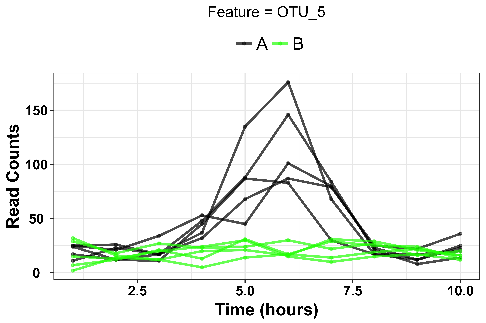
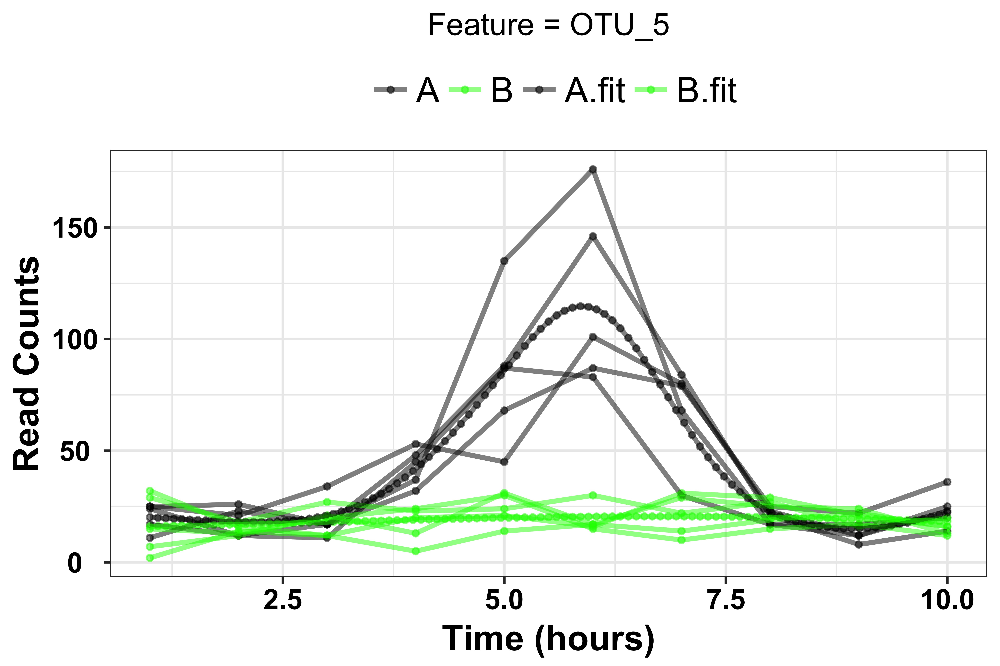

# What is MetaLonDA?

[](https://travis-ci.org/aametwally/MetaLonDA)
[](http://www.rdocumentation.org/packages/MetaLonDA)
[](https://cran.r-project.org/package=MetaLonDA)
[](https://cranlogs.r-pkg.org/badges/grand-total/MetaLonDA)
[](https://en.wikipedia.org/wiki/MIT_License)


MetaLonDA (METAgenomic LONgitudinal Differential Abundance method) is a method that identifies the significant time intervals of microbial features in longitudinal studies. MetaLonDA has the ability to handle the inconsistencies and common challenges associated with human studies, such as variable sample collection times and uneven number of time points along the subjects’ longitudinal study. The method employs a negative binomial distribution in conjunction with a semi-parametric SS-ANOVA to model the read counts. Then, it performs the significance testing based on unit time intervals using permutation testing procedure.


## Publications:
* Ahmed A. Metwally, Jie Yang, Christian Ascoli, Yang Dai, Patricia W. Finn, and David L. Perkins. "MetaLonDA: a flexible R package for identifying time intervals of differentially abundant features in metagenomic longitudinal studies", Microbiome, 2018.  [[paper](https://microbiomejournal.biomedcentral.com/articles/10.1186/s40168-018-0402-y)]
* Ahmed A. Metwally, Patricia W. Finn, Yang Dai, and David L. Perkins. "Detection of Differential Abundance Intervals in Longitudinal Metagenomic Data Using Negative Binomial Smoothing Spline ANOVA." ACM BCB, 2017. [[paper](https://dl.acm.org/citation.cfm?id=3107429)]


<br>

# Getting Started
This section details steps for installing and running MetaLonDA. If you experience difficulty installing or running the software, please contact (Ahmed Metwally: ametwa2@uic.edu).

## Prerequisites

* R(>= 3.2.0)

<br>

## Installation

#### Install MetaLonDA from CRAN:
Install the latest released version from CRAN: https://cran.r-project.org/web/packages/MetaLonDA/index.html
```
install.packages("MetaLonDA")
```


#### Install MetaLonDA from GitHub:
Download the latest development code of MetaLonDA from GitHub using devtools
```
library(devtools)
install_github("aametwally/MetaLonDA")
```


<br>


## Example:
```
library(MetaLonDA)

## Load read counts of 8 features from 100 samples. Samples are from 2 groups, 5 subjects per group, and 10 time points per subject.
data(metalonda_test_data)
View(metalonda_test_data[,1:20])
```


```
## Create Group, Time, and ID annotation vectors
n.group = 2
n.sample = 5 
n.timepoints = 10
Group = factor(c(rep("A", n.sample*n.timepoints), rep("B",n.sample*n.timepoints)))
Time = rep(rep(1:n.timepoints, times = n.sample), 2)
ID = factor(rep(1:(2*n.sample), each = n.timepoints))

## Define the prediction timeponits 
points = seq(1, 10, length.out = 100)
```

### Test one feature 

```
## Identify significant time intervals of the 5th feature: 
output.metalonda.f5 = metalonda(Count = metalonda_test_data[5,], Time = Time, Group = Group,
                                ID = ID, n.perm = 100, fit.method = "nbinomial", points = points,
                                text = rownames(metalonda_test_data)[5], parall = FALSE, pvalue.threshold = 0.05,     
                                adjust.method = "BH")
```

In our example, we used 20 permutations just to showcase how MetaLonDA works. In real analysis, this number should be much higher. Three figures are generated after running the above snippet:


<br> 

1. Figure shows the trajectory of the feature's count across different time points:

<p align="center">
  
</p>


<br><br>
2. Figure shows fitted spline for each group:


<br><br>

3. In case there is a significant time interval, the following figure is generated to highlight the significant intervals.


<br><br>

### Test all features 
```
## Identify significant time intervals for all features: 
output.metalonda.all = metalondaAll(Count = metalonda_test_data, Time = Time, Group = Group,
  ID = ID, n.perm = 100, fit.method = "nbinomial", num.intervals = 100, 
  parall = FALSE, pvalue.threshold = 0.05, adjust.method = "BH", time.unit = "hours", norm.method = "none",
  prefix = "Test")
  
```

After running the above snippet for testing all features in the count matrix, along with the 2-3 figures for each feature, MetaLonDA produces the following two summary files:


<br>
1. Figure illustrates time intervals of differentially abundant features between the two groups. Each line represents a range of the significant time interval of the corresponding feature. 


<br><br>
2. Descriptive summary all signifcant time intervals of differentially abundant features


<br>

### Bugs and Suggestions
MetaLonDA is under active research development. Please report any bugs/suggestions to Ahmed Metwally (ametwa2@uic.edu).
